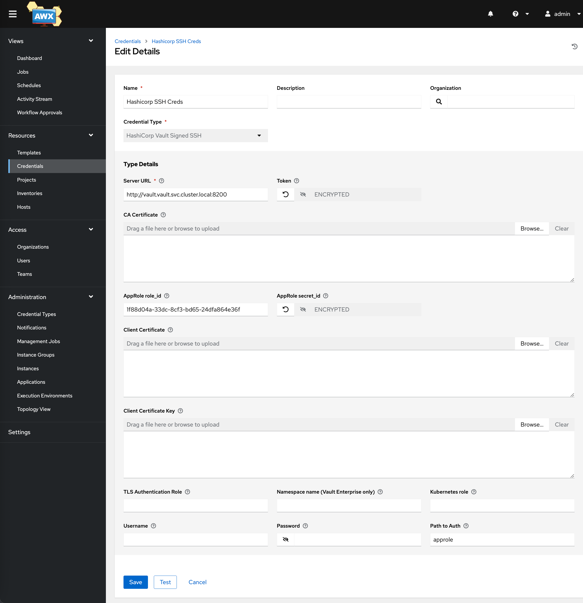
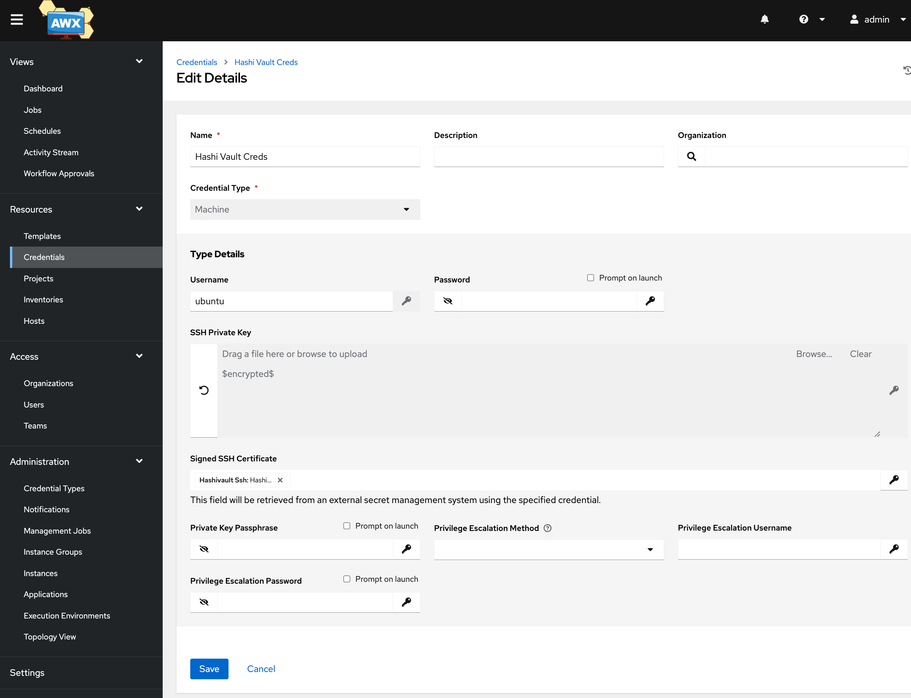
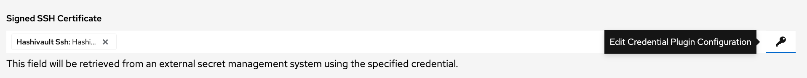
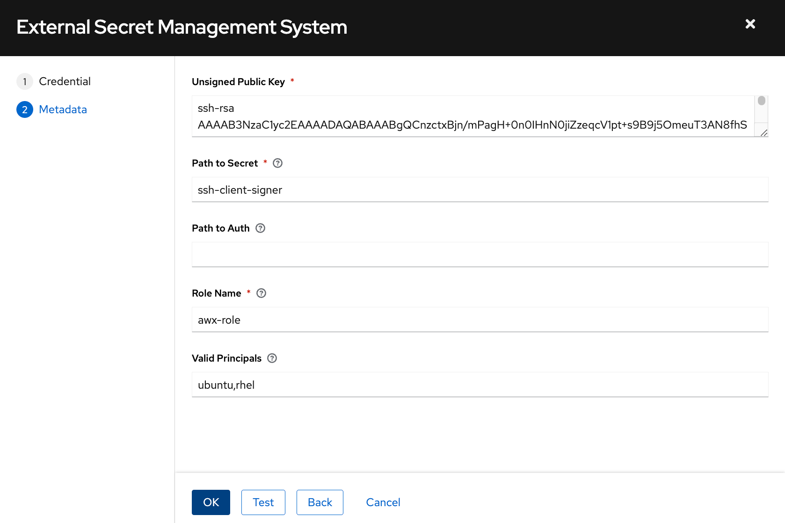

Here’s the revised version of the README with improved formatting, numbering, and organization:

---

# **Setup Guide: Vault in Minikube, Docker VMs, and SSH Certificates for Ansible Tower (AWX)**

This guide will walk you through the process of setting up **HashiCorp Vault** inside a **Minikube** cluster, creating **Docker containers** as VMs, configuring Vault's **SSH CA** engine, and authenticating with **Ansible Tower (AWX)** using Vault's signed SSH certificates.

---

## **Prerequisites**

- **macOS** (or Linux) with **Minikube**, **Docker**, **helm**, and **kubectl** installed.
- **HashiCorp Vault** installed.
- **Ansible Tower (AWX)** installed.
- ***SSH keys for authentication***

---

## **Step 1: Set Up Vault in Minikube**

### **1.1 Start Minikube**

Start a Minikube cluster with Docker as the driver:

```bash
minikube start --driver=docker
```

### **1.2 Install Vault in Minikube**

You can use **Helm** to deploy Vault in Minikube.

1. **Add Vault Helm repository**:

   ```bash
   helm repo add hashicorp https://helm.releases.hashicorp.com
   helm repo update
   ```

2. **Install Vault**:

   ```bash
   kubectl create ns vault; helm install vault hashicorp/vault -n vault -f vault_values.yaml    
   ```

3. **Verify Vault Installation**:

   ```bash
   kubectl get pods
   ```

   Vault should be running in your Minikube cluster.

### **1.3 Initialize Vault**

```bash
kubectl exec -n vault vault-0 -- sh -c "vault operator init -key-shares=1 -key-threshold=1 -format=json" | tee init.json
```

### **1.4 Unseal Vault**

```bash
kubectl exec -n vault vault-0 -- sh -c "vault operator unseal $(jq -r .unseal_keys_b64[0] init.json)"  
```

***NOTE:*** If using zsh, use this command instead:

```bash
kubectl exec -n vault vault-0 -- sh -c "vault operator unseal $(jq -r '.unseal_keys_b64[0]' init.json)"
```

### **1.5 Set Vault Environment Variables**

Port forward Vault service:

```bash
kubectl port-forward -n vault svc/vault 8200:8200
```

To access the Vault server, export the required environment variables:

```bash
export VAULT_ADDR=http://localhost:8200
export VAULT_TOKEN=$(jq -r .root_token init.json)
```

---

## **Step 2: Configure SSH CA in Vault**

### **2.1 Enable SSH Secrets Engine**

Enable the **SSH** secrets engine in Vault:

```

vault secrets enable -path=ssh-client-signer ssh

```

### **2.2 Configure a Policy**

```
vault policy write lab-policy - <<EOF
path "auth/approle/role/lab-approle-role/role-id" {
  capabilities = ["read"]
}

path "auth/approle/role/lab-approle-role/secret-id" {
  capabilities = ["update"]
}

path "ssh-client-signer/sign/awx-role" {
  capabilities = ["create", "read"]
}

path "ssh-client-signer/issue/awx-role" {
  capabilities = ["create", "read"]
}
EOF
```

### **2.3 Configure SSH Engine**

Configure Vault with a CA for signing client keys:

```bash

vault write ssh-client-signer/config/ca generate_signing_key=true

```

### **2.4 Create Signing Role**

Create a named Vault role for signing client keys:

```
vault write ssh-client-signer/roles/awx-role -<<"EOH"
{
  "algorithm_signer": "rsa-sha2-256",
  "allow_user_certificates": true,
  "allowed_users": "*",
  "allowed_extensions": "permit-pty,permit-port-forwarding",
  "default_extensions": {
    "permit-pty": ""
  },
  "key_type": "ca",
  "default_user": "rhel,ubuntu", 
  "ttl": "2m0s"
}
EOH
```

***Check all parameters configured for the created role:***

```bash
vault read ssh-client-signer/roles/awx-role
```

### **2.5 Enable appRole Authentication**

```bash
vault auth enable approle
```

### **2.6 Create a Role for AWX**

```bash

vault write auth/approle/role/awx-role \
    token_policies=lab-policy \
    token_ttl=1h \
    token_max_ttl=4h \
    secret_id_ttl=24h \
    secret_id_num_uses=0
```

---
### 2.7 Get RoleID and SecretID

vault read auth/approle/role/awx-role/role-id | tee role-id.json

vault write -f auth/approle/role/awx-role/secret-id | tee secret-id.json

## **Step 3: Configure Vault's Kubernetes Auth Method**

This step is required to allow pods within Kubernetes to connect to Vault:

```bash
vault auth enable -path=kubernetes kubernetes
```

Export Kubernetes host:

```bash
export K8S_HOST=$(kubectl exec vault-0 -n vault -- sh -c 'echo "https://$KUBERNETES_PORT_443_TCP_ADDR:$KUBERNETES_SERVICE_PORT_HTTPS"')
```

Configure Kubernetes authentication:

```bash
vault write auth/kubernetes/config kubernetes_host="$K8S_HOST"
vault read auth/kubernetes/config
```

### **3.1 Write a Policy for Kubernetes**

```
vault write auth/kubernetes/role/awx-role \
bound_service_account_names=default \
bound_service_account_namespaces=default,app,app2,app3 \
policies=lab-policy \
audiences=vault \
ttl=24h

```

---

## **Step 4: Create Docker Containers as VMs**

### **4.1 Build Docker Image**

We will create Docker containers that act as virtual machines (VMs) and configure them with the **rhel** user, SSH, and principals.

Build the Docker image:

```bash
docker build -t awx-ssh .
```

### **4.2 Create a Docker Network**

Create a custom Docker network for the VMs:

```bash
docker network create --subnet=192.168.1.0/24 awx-network
```

### **4.3 Create Docker Containers**

Create 3 Docker containers that will simulate virtual machines:

```bash
docker run -d --name vm1  --network awx-network -p 12222:22 awx-ssh
docker run -d --name vm2  --network awx-network -p 12223:22 awx-ssh
docker run -d --name vm3  --network awx-network -p 12224:22 awx-ssh 
```

**NOTE:** If using Minikube, you will need to run a tunnel in a separate terminal:

```bash
minikube tunnel
```

---

## **Step 5: Test SSH Access**

### **5.1 Request SSH Keys**

Generate SSH keys signed by Vault:

```
vault write -format json ssh-client-signer/issue/awx-role valid_principals="rhel,ubuntu" | tee ssh-keys.json
```

Look into the created certificate to check the principals that have access to:

```
jq -r .data.signed_key ssh-keys.json | sed '$d' | ssh-keygen -Lf -
```

Save the private key:

```
jq -r .data.private_key ssh-keys.json | sed '$d' | tee mypkey
```

Save the Vault-signed public key:

```bash
jq -r .data.signed_key ssh-keys.json | sed '$d' | tee mypkey-cert.pub
```

Change permissions to both keys:

```bash
chmod 600 mypkey*
```

### **5.2 Copy Vault's Public Key to VMs**

Copy the unsigned public key from Vault:

```

curl -k -o trusted-user-ca-keys.pem $VAULT_ADDR/v1/ssh-client-signer/public_key

```

Copy the public key to the target VMs:

```
docker cp trusted-user-ca-keys.pem vm1:/etc/ssh/trusted-user-ca-keys.pem
docker cp trusted-user-ca-keys.pem vm2:/etc/ssh/trusted-user-ca-keys.pem
docker cp trusted-user-ca-keys.pem vm3:/etc/ssh/trusted-user-ca-keys.pem
```

### **5.3 SSH into the Target Machines**

```bash
ssh -i mypkey -i mypkey-cert.pub rhel@localhost -p 12222  
ssh -i mypkey -i mypkey-cert.pub rhel@localhost -p 12223  
ssh -i mypkey -i mypkey-cert.pub rhel@localhost -p 12224  
```

---

## **Step 6: Configure Ansible Tower (AWX)**

### **6.1 Install Ansible Tower (AWX)**

Follow the [AWX Installation Guide](https://github.com/ansible/awx/blob/devel/docs/installation.md) for official installation instructions.

Alternatively, use the `awx-operator` to deploy AWX in your Kubernetes cluster:

```
cd awx-operator; make deploy
```

Wait until the Operator pod is running:

```
kubectl get pods -n awx
```

Deploy AWX instance

```
kubectl apply -k .
```

### **6.2 Create a Vault Credential in AWX**

1. Go to the **Credentials** section in AWX.
2. Create a new **HashiCorp Vault Signed SSH** credential type and enter the Vault server URL and token.



3. Save.
4. Go to the **Credentials** section again and add a new **Machine** type credentials



**username**: Make sure to use a valid username, based on the vaild_principals configured in section 2.4

**SSH Private Key**: Paste the private key AWX will need to log into the target VMs

**Signed SSH Certificate**: Click on the Key icon on the right side of the screen:



You should get another window like this:




Fill the details with:

**unsigned Public Key**: Public key of the private key provided in previous step

**path-to-secret**: Path where you enabled SSH in Vault

**role-name**: Role to allow AWX to request a signed key

**valid-principals**: users allow to authenticate in the target VM


